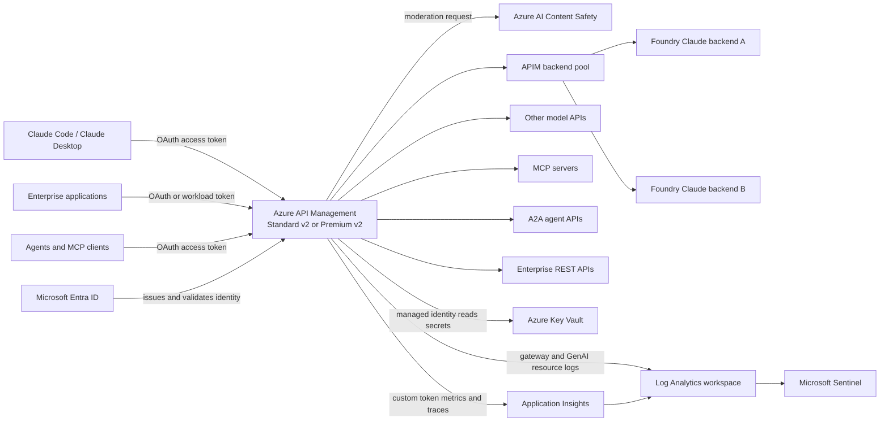

# APIM + Microsoft Foundry + Claude Code Enterprise Implementation Guide

## Purpose

This guide explains how to use the Azure portal to implement an enterprise AI gateway with Azure API Management (APIM) in front of Claude models hosted through Microsoft Foundry. It also shows how to place other model APIs, MCP servers, A2A agent APIs, and conventional enterprise APIs behind the same policy and operational boundary.

The detailed implementation focuses on:

- Azure AI Content Safety for prompts and responses.
- Azure-native logs, metrics, Application Insights, Log Analytics, Microsoft Sentinel, retention, investigation, and chargeback.
- Tokens-per-minute (TPM) limits and periodic token quotas keyed by application or validated user identity.
- Priority-based, weighted, and session-aware backend pools with circuit breakers.
- Model routing across model families, provisioned and pay-as-you-go capacity, and canary deployments.
- Semantic caching, including its similarity, isolation, and telemetry tradeoffs.
- A common governance boundary across AI and non-AI APIs.
- Entra ID authentication, Azure RBAC, managed identity, Key Vault, and private networking.

> **Portal and feature currency:** Portal labels and preview features can change. This guide was validated against Microsoft documentation available on August 11, 2026. Confirm the linked service documentation and the feature matrix for the selected APIM tier before production rollout.

## Validated Advantages and Their Azure Implementations

| Enterprise advantage | Azure implementation |
|---|---|
| One policy and operational boundary | One APIM service, with global baseline policies and narrower product, API, or operation policies for Claude, other model APIs, MCP, A2A, and REST APIs |
| Managed identity, Entra authorization, RBAC, and Key Vault | APIM managed identity for supported Azure backends and Key Vault; `validate-azure-ad-token` at ingress; Azure RBAC for administrators |
| TPM, quotas, pools, and circuit breaking | `llm-token-limit`, backend pools, weighted and priority routing, optional session affinity, and per-backend circuit-breaker rules |
| Model routing and cost tiering | `<choose>` on the validated model or caller, priority pools for provisioned-first with pay-as-you-go overflow, and optional model aliasing |
| Cost and latency reduction | `llm-semantic-cache-lookup` and `llm-semantic-cache-store` with an external Redis cache, partitioned per caller |
| Organization-controlled safety | `llm-content-safety` backed by an Azure AI Content Safety resource, with organization-selected thresholds, Prompt Shields, and blocklists |
| Azure-native operations | APIM resource logs to Log Analytics, token metrics to Application Insights, workbooks and alerts in Azure Monitor, and security investigation in Sentinel |
| Private networking and platform reuse | APIM inbound private endpoint, Standard v2/Premium v2 outbound VNet integration, private endpoints for supported backends, Azure Policy, IaC, and existing incident-response processes |
| Consolidation for existing APIM estates | Shared identity, policy, inventory, release, monitoring, and support patterns instead of a separate gateway for each AI provider or protocol |

## 1. Target Architecture



### Recommended production resource set

| Resource | Recommended baseline |
|---|---|
| API Management | Standard v2 for a regional production gateway; Premium v2 when full VNet injection, higher scale, or advanced isolation is required |
| Microsoft Foundry | Claude deployment plus at least one separately deployable failover target if backend pooling is required |
| Azure AI Content Safety | One resource per environment or regulated boundary; use a region approved for the data classification |
| Key Vault | RBAC permission model, soft delete, purge protection, and private endpoint where required |
| Log Analytics | One workspace aligned with the operations/SOC boundary; use resource-specific tables |
| Application Insights | Workspace-based and linked to the Log Analytics workspace |
| Microsoft Sentinel | Enabled on the same workspace when the SOC will investigate gateway events |
| Entra ID | One resource/API app registration plus one or more public or confidential client registrations |
| Networking | Inbound APIM private endpoint where clients are private; outbound VNet integration to private backends |

### Important Claude and APIM constraints

1. The Anthropic Messages API is supported as an APIM language-model API in APIM v2 tiers. Use Standard v2 or Premium v2 for the portal-first implementation in this guide.
2. The newer dedicated **AI Gateway tier** is a separate preview experience. Do not confuse its card-based policy UX with an APIM Standard v2 instance. This guide uses the established APIM service and XML policy editor.
3. Claude Code uses the Anthropic Messages API and server-sent event (SSE) streaming. Keep response buffering disabled on the forwarding policy.
4. Managed identity works only when the specific Foundry backend accepts Entra authentication and the APIM identity can receive RBAC in the backend tenant.
5. In this repository's cross-tenant pilot, the Foundry resource is in another Entra tenant without federation. APIM therefore reads the backend API key from Key Vault and injects it as `x-api-key`. This is an explicit exception, not the preferred same-tenant pattern.

## 2. Implementation Sequence

Implement the gateway in this order:

1. Confirm subscription, tenant, tier, region, and ownership boundaries.
2. Create the Log Analytics workspace and workspace-based Application Insights resource.
3. Create or select the APIM Standard v2/Premium v2 instance.
4. Enable APIM managed identity and assign least-privilege RBAC.
5. Configure Entra app registrations and client authorization.
6. Import and publish Claude, other model, MCP, A2A, and conventional APIs.
7. Apply the common ingress baseline.
8. Add Content Safety to applicable APIs.
9. Add token limits, quotas, metrics, and metadata-only traces.
10. Create backend entities, circuit breakers, and pools.
11. Configure model, capacity, and consumer routing.
12. Evaluate and, where justified, enable semantic caching.
13. Enable resource logs, Application Insights logging, dashboards, and alerts.
12. Onboard the workspace to Sentinel and implement investigation rules.
13. Configure retention and chargeback reporting.
14. Configure private networking.
15. Validate positive, denial, throttle, failover, streaming, and investigation paths.
16. Export or reproduce every portal change in Bicep and Azure Policy.

## 3. Prerequisites and Design Decisions

### Required permissions

Use separate deployment and operations roles where possible.

| Task | Typical required role |
|---|---|
| Create or configure APIM | API Management Service Contributor, or Contributor at the scoped resource group |
| Assign RBAC to managed identities | Owner or User Access Administrator at the target scope |
| Configure Key Vault secrets | Key Vault Secrets Officer for secret administration |
| Let APIM read Key Vault secrets | Key Vault Secrets User assigned to the APIM managed identity |
| Configure Log Analytics | Log Analytics Contributor |
| Configure Application Insights | Application Insights Component Contributor or Contributor |
| Enable and administer Sentinel | Microsoft Sentinel Contributor; additional roles may be needed for automation rules and playbooks |
| Configure Entra applications | Application Administrator or Cloud Application Administrator; admin consent requires a suitable tenant role |

### Record these decisions before configuration

| Decision | Example |
|---|---|
| APIM tier | Standard v2 |
| Gateway hostname | `https://contoso-ai.azure-api.net` |
| Entra tenant | `contoso.onmicrosoft.com` |
| Resource API audience | `api://<gateway-api-app-id>` |
| Delegated scope | `Inference.Invoke` |
| Application role | `AI.Gateway.Invoke` |
| User counter claim | `oid` |
| Application counter claim | `azp`, with `appid` fallback for v1 tokens |
| Prompt safety thresholds | Eight-level output; block at severity 4 initially |
| Response safety | Enabled only after streaming and latency validation |
| User TPM | 30,000 tokens/minute |
| User monthly quota | 5,000,000 tokens/month |
| Application TPM | Set below the backend deployment's allocated capacity |
| Interactive log retention | 90 days for Sentinel-enabled operational tables |
| Total retention | Organization-specific, for example 730 days |
| Prompt/completion body logging | Off by default |
| Chargeback unit | Tokens by application, cost center, model, and environment |

### Use data classifications, not convenience, to choose logging

Prompts and completions can contain source code, credentials, personal data, regulated data, and proprietary content. The recommended default is:

- Log metadata, token counts, model, API, status, latency, backend, correlation ID, application ID, and a pseudonymous user key.
- Do not log Authorization headers, backend keys, full prompts, completions, or tool arguments.
- Enable content logging only for a specifically approved use case with sampling, redaction, access control, short retention, and documented legal/privacy review.

## 4. Create the Observability Foundation First

Creating diagnostics before the APIs avoids blind troubleshooting during identity and policy setup.

### 4.1 Create a Log Analytics workspace

1. In the Azure portal, search for **Log Analytics workspaces**.
2. Select **Create**.
3. Select the subscription and resource group.
4. Enter a name such as `law-ai-gateway-prod-weu`.
5. Select the same geography required for the gateway's operational data.
6. Select **Review + create**, then **Create**.
7. Open the workspace.
8. Select **Usage and estimated costs** > **Data Retention**.
9. Set the workspace default to the approved baseline. Use 90 days when Sentinel needs the full interactive investigation window, unless a different SOC standard applies.
10. Select **Tables** and later apply table-level retention to the APIM tables after the first records create them.

### 4.2 Create workspace-based Application Insights

1. Search for **Application Insights**.
2. Select **Create**.
3. Select the same resource group and region as the monitoring boundary.
4. Enter a name such as `appi-ai-gateway-prod-weu`.
5. Under **Workspace details**, select the Log Analytics workspace created above.
6. Select **Review + create**, then **Create**.
7. Open Application Insights.
8. Select **Usage and estimated costs**.
9. Select **Custom metrics (Preview)** > **With dimensions**, then select **OK**.

> The APIM Application Insights diagnostic entity must also have custom metric emission enabled. If the portal experience does not expose the `metrics` switch, set it through the APIM management API or IaC. Treat this as a required deployment item when using `llm-emit-token-metric`.

### 4.3 Enable APIM resource logs

1. Open the APIM instance.
2. Under **Monitoring**, select **Diagnostic settings**.
3. Select **Add diagnostic setting**.
4. Name it `send-to-law`.
5. Under **Logs**, select:
   - **Logs related to ApiManagement Gateway**.
   - **Logs related to generative AI gateway**, when shown for the tier and imported API type.
6. Enable relevant platform metrics if the organization collects them in Log Analytics.
7. Under **Destination details**, select **Send to Log Analytics workspace**.
8. Select the workspace created above.
9. Select **Resource specific** as the destination table mode.
10. Select **Save**.

Allow approximately 15 minutes for an existing workspace to receive data. A newly created workspace can take longer to become queryable.

### 4.4 Connect APIM to Application Insights

1. In APIM, select **APIs** > **Loggers** or **Application Insights**, depending on the current portal blade.
2. Select **Add**.
3. Select the Application Insights resource.
4. Prefer a managed connection where the portal supports it. Otherwise, use a Key Vault-backed named value for the connection string.
5. Select **APIs** > **APIs** > the Claude API > **Settings**.
6. In **Diagnostic Logs**, select the **Application Insights** tab.
7. Enable logging.
8. Start with 100% sampling only during controlled validation. Choose a lower production sampling rate based on traffic volume and investigation requirements.
9. Log errors and basic request metadata.
10. Do not include Authorization, subscription keys, `x-api-key`, request bodies, or response bodies.
11. Save the API settings.

### Checkpoint

Send one test request through APIM, then run:

```kusto
ApiManagementGatewayLogs
| where TimeGenerated > ago(30m)
| order by TimeGenerated desc
| take 20
```

If there are no records, fix diagnostic settings before continuing.

## 5. Configure Identity, RBAC, and Key Vault

### 5.1 Enable APIM managed identity

1. Open the APIM instance.
2. Select **Security** > **Managed identities** or **Identity**.
3. On **System assigned**, set **Status** to **On**.
4. Select **Save**.
5. Record the displayed principal/object ID.

Use a user-assigned identity when lifecycle separation or different identities per backend are required. Use the system-assigned identity for a simpler single-gateway deployment.

### 5.2 Grant managed identity to a supported Foundry backend

Use this path only when the Claude/Foundry endpoint supports Entra authentication in the same trust boundary.

1. Open the Foundry resource that owns the deployment.
2. Select **Access control (IAM)** > **Add** > **Add role assignment**.
3. Select the role documented for the specific Foundry model endpoint. Depending on the resource and API surface, this can be **Foundry User**, **Cognitive Services User**, or **Cognitive Services OpenAI User**.
4. Select **Managed identity**.
5. Select the APIM instance's system-assigned or user-assigned identity.
6. Select **Review + assign**.
7. Wait several minutes for propagation.

Do not select a role by analogy. Verify the exact role in the backend's authentication documentation and use the narrowest valid scope.

### 5.3 Configure Key Vault for backend credentials when managed identity is unavailable

This is the required path for this repository's cross-tenant Claude backend.

1. Create or open the Key Vault.
2. Under **Settings** > **Access configuration**, select the Azure RBAC permission model.
3. Under **Objects** > **Secrets**, select **Generate/Import**.
4. Create a secret such as `foundry-claude-api-key`.
5. Paste the backend key and set an expiration date aligned with the rotation standard.
6. Select **Create**.
7. Open **Access control (IAM)** > **Add role assignment**.
8. Select **Key Vault Secrets User**.
9. Select **Managed identity**, then select the APIM identity.
10. Select **Review + assign**.
11. In APIM, open **APIs** > **Named values** > **Add**.
12. Enter display name `Foundry Claude API key` and name `foundry-api-key`.
13. Select **Secret**.
14. Select **Key vault** as the value source.
15. Select the vault and the unversioned secret identifier so rotation can be picked up automatically.
16. Select the APIM managed identity and save.
17. Reopen the named value and confirm the Key Vault status is successful.

If the Key Vault firewall is enabled, confirm the selected APIM networking mode and managed identity combination is supported. For a Key Vault firewall scenario, APIM documentation requires the system-assigned identity in configurations where user-assigned identity access is not supported.

### 5.4 Create Entra app registrations for ingress

Use separate resource and client applications.

#### Create the gateway resource/API application

1. Open **Microsoft Entra ID** > **App registrations** > **New registration**.
2. Name it `AI-Gateway-API`.
3. Select the required tenant scope, normally **Accounts in this organizational directory only**.
4. Select **Register**.
5. Open **Expose an API**.
6. Set the Application ID URI to `api://<application-client-id>`.
7. Select **Add a scope**.
8. Create delegated scope `Inference.Invoke`.
9. Set admin and user consent descriptions according to the governance standard.
10. Optionally open **App roles** and add `AI.Gateway.Invoke` for workload or group-based authorization.

#### Create the Claude Code/Desktop public client

1. Select **App registrations** > **New registration**.
2. Name it `Claude-Cowork-Client` or the organization-approved name.
3. Register it as a single-tenant application.
4. Open **Authentication** > **Add a platform** > **Mobile and desktop applications**.
5. Add the exact loopback redirect URI required by the Claude client configuration.
6. Do not create a client secret for a public desktop client.
7. Open **API permissions** > **Add a permission** > **My APIs**.
8. Select `AI-Gateway-API` and delegated permission `Inference.Invoke`.
9. Select **Grant admin consent** if tenant policy and pilot approval permit it.

For confidential applications, create a separate client registration and use a certificate or workload identity federation rather than sharing the desktop client identity.

## 6. Establish One Policy and Operational Boundary

The goal is one gateway and one governance model, not one identical XML policy for every protocol.

### 6.1 Use APIM scopes deliberately

APIM policies inherit in this order:

```text
Global -> Workspace -> Product -> API -> Operation
```

Use `<base />` at each narrower scope to inherit the parent policy.

| Scope | Recommended controls |
|---|---|
| Global | Correlation ID, removal of untrusted credential headers, common security headers, baseline logging, approved TLS/network behavior |
| Product | Consumer class limits, subscription behavior, environment policy, business-unit ownership |
| API | Protocol-aware token validation, content safety, request validation, backend selection, API-specific metrics |
| Operation | Claude `/v1/messages` body/model checks, streaming behavior, exceptions for health/discovery operations |

Do not place an LLM body parser globally. A conventional REST API, MCP request, A2A message, and Anthropic request do not have the same schema.

### 6.2 Create a shared global baseline

1. Open APIM.
2. Select **APIs** > **All APIs**.
3. In **Inbound processing**, select the code editor (`</>`).
4. Add the approved global controls.
5. Save.

Example baseline:

```xml
<policies>
  <inbound>
    <base />
    <set-header name="x-correlation-id" exists-action="skip">
      <value>@(context.RequestId.ToString())</value>
    </set-header>
    <set-header name="x-api-key" exists-action="delete" />
    <set-header name="Ocp-Apim-Subscription-Key" exists-action="delete" />
  </inbound>
  <backend>
    <base />
  </backend>
  <outbound>
    <base />
    <set-header name="x-correlation-id" exists-action="override">
      <value>@(context.RequestId.ToString())</value>
    </set-header>
  </outbound>
  <on-error>
    <base />
  </on-error>
</policies>
```

> If APIM subscription keys are intentionally used for some products, do not delete `Ocp-Apim-Subscription-Key` globally. Remove it only on operations that use Entra as the sole client authentication method.

### 6.3 Create an API inventory and ownership model

1. In APIM, create products such as `Enterprise AI`, `Enterprise Agents`, and `Enterprise APIs` only when they represent meaningful publication or consumer boundaries.
2. Add Claude and other LLM APIs to the AI product.
3. Import remote MCP servers or expose approved REST APIs as MCP servers.
4. Import A2A APIs using their supported contract.
5. Import standard OpenAPI APIs normally.
6. Assign an owner, data classification, backend owner, on-call team, and chargeback code to every API.
7. Use APIM tags to label environment, criticality, data classification, protocol, and cost center.
8. Mirror the inventory in Azure API Center if the organization uses it for discovery and governance.

### 6.4 Import the Claude Anthropic Messages API

1. Open APIM > **APIs** > **Add API**.
2. Select the language-model or Anthropic passthrough import option shown for the v2 tier. If no Anthropic wizard is available, select **HTTP** and define the operations explicitly.
3. Set the display name, API identifier, and path.
4. Add `POST /v1/messages`.
5. Add `GET /v1/models` only if APIM will expose a controlled model discovery response.
6. Set **Subscription required** to **Off** only when Entra token validation is mandatory for every operation.
7. Save the API.
8. Add a backend entity rather than embedding a backend URL in every operation.

### 6.5 Apply Entra token validation

At the Claude operation policy, validate tenant, audience, authorized client, scope, and optionally role. Capture the validated token for later policy decisions.

```xml
<validate-azure-ad-token
    tenant-id="{{entra-tenant-id}}"
    header-name="Authorization"
    failed-validation-httpcode="401"
    failed-validation-error-message="Missing or invalid access token."
    output-token-variable-name="gatewayJwt">
  <audiences>
    <audience>{{gateway-api-client-id}}</audience>
  </audiences>
  <client-application-ids>
    <application-id>{{cowork-client-id}}</application-id>
  </client-application-ids>
  <required-claims>
    <claim name="scp" match="any" separator=" ">
      <value>Inference.Invoke</value>
    </claim>
  </required-claims>
</validate-azure-ad-token>
```

For multiple authorized clients, add each approved client application ID. Do not accept every client in the tenant merely because the token has the correct audience.

### 6.6 Protocol-specific application

| API type | Shared controls | Protocol-specific controls |
|---|---|---|
| Claude/other LLM | Entra, correlation, logging, networking, backend governance | Model allowlist, LLM token limit, prompt/completion safety, token metrics, streaming |
| MCP | Entra/OAuth, caller limits, content safety where supported, logging | Tool allowlist, tool-level authorization, request-rate limits, MCP protocol validation |
| A2A | Entra/OAuth, caller limits, content safety where supported, logging | Agent card validation, task/operation authorization, A2A schema controls |
| Conventional REST | Entra/OAuth, rate limits, logging, backend pools | OpenAPI/schema validation, HTTP caching, REST-specific transformations |

This is how APIM becomes one operational boundary without forcing every traffic type through an unsafe generic policy.

## 7. Implement Azure AI Content Safety

Content Safety is an independently governed control selected by the organization. It should not be described as inherently better than a model provider's built-in safety. Its value is separate administration, consistent policy, evidence, and tuning across supported model, MCP, and A2A traffic.

### 7.1 Create the Azure AI Content Safety resource

1. In the portal, select **Create a resource**.
2. Search for **Content Safety**.
3. Select **Create**.
4. Choose the subscription, resource group, approved region, name, and pricing tier.
5. Configure networking according to the target architecture.
6. Select **Review + create**, then **Create**.

### 7.2 Grant APIM access

1. Open the Content Safety resource.
2. Select **Access control (IAM)** > **Add role assignment**.
3. Select **Cognitive Services User**.
4. Select **Managed identity**.
5. Select the APIM managed identity.
6. Select **Review + assign**.

### 7.3 Create the APIM Content Safety backend

1. Open APIM > **APIs** > **Backends**.
2. Select **Create new backend**.
3. Name it `content-safety-backend`.
4. Select **Custom URL**.
5. Set the runtime URL to:

   ```text
   https://<content-safety-resource-name>.cognitiveservices.azure.com
   ```

6. Under **Authorization credentials**, select **Managed identity**.
7. Select the APIM system-assigned or approved user-assigned identity.
8. Enter this exact resource/audience:

   ```text
   https://cognitiveservices.azure.com
   ```

9. Keep TLS certificate chain and name validation enabled.
10. Select **Create**.

### 7.4 Decide the safety policy

Start with a documented threshold matrix approved by security, responsible AI, legal/privacy, and application owners.

| Category | Initial eight-level block threshold | Meaning |
|---|---:|---|
| Hate | 4 | Allow 0-3; block 4-7 |
| Self-harm | 4 | Allow 0-3; block 4-7 |
| Sexual | 4 | Allow 0-3; block 4-7 |
| Violence | 4 | Allow 0-3; block 4-7 |
| Prompt Shields | Enabled | Detect likely jailbreak and prompt-injection patterns |
| Custom blocklists | Organization-specific | Block prohibited terms or data patterns after legal and false-positive review |

Lower thresholds are more restrictive. Tune each category independently based on intended use, not by copying a universal value.

### 7.5 Add request moderation to the Claude API

1. Open APIM > **APIs** > the Claude API.
2. Select **All operations** or the specific `POST /v1/messages` operation.
3. In **Inbound processing**, open the code editor.
4. Place Content Safety after caller authentication and before token accounting/backend selection.
5. Add:

```xml
<llm-content-safety backend-id="content-safety-backend" shield-prompt="true">
  <categories output-type="EightSeverityLevels">
    <category name="Hate" threshold="4" />
    <category name="SelfHarm" threshold="4" />
    <category name="Sexual" threshold="4" />
    <category name="Violence" threshold="4" />
  </categories>
  <blocklists>
    <id>enterprise-ai-deny-list</id>
  </blocklists>
</llm-content-safety>
```

Remove the `<blocklists>` section until the named blocklist exists in the Content Safety resource.

### 7.6 Decide whether to moderate responses

Response moderation can be enabled with `enforce-on-completions="true"` in the inbound Content Safety policy, or by applying the policy in the outbound section as documented for the API format.

For Claude Code, validate this carefully because:

- Responses are usually streamed with SSE.
- APIM evaluates streaming output in sliding windows.
- When a violation is found after streaming has started, APIM stops forwarding further events; it cannot replace the already-started stream with a normal `403` response.
- Content Safety adds latency and service dependency.
- Large request or response text beyond the supported Content Safety character limits is rejected.

Recommended rollout:

1. Enable prompt moderation first.
2. Test normal source-code prompts, code blocks, stack traces, and security-testing language for false positives.
3. Enable response moderation in a nonproduction API revision.
4. Test both streamed and nonstreamed responses.
5. Measure added latency and interrupted-stream client behavior.
6. Promote the revision only after application owners accept the behavior.

> The APIM `llm-content-safety` policy is an enforcement policy: detections are blocked. It does not provide a general log-only switch in the XML policy documented for APIM. A calibration phase therefore needs a separate test revision, controlled shadow evaluation outside the request path, or another approved observation design. Do not claim log-only operation unless the exact selected gateway tier exposes and documents it.

### 7.7 Content Safety validation

Test at least:

| Test | Expected result |
|---|---|
| Normal coding prompt | Backend response succeeds |
| Prompt matching a configured high-severity category | APIM returns `403` before backend invocation |
| Prompt-injection test string | Prompt Shield blocks according to current detection behavior |
| Custom blocklist term | APIM returns `403` |
| Content Safety backend unavailable | Request behavior matches the documented policy failure mode; alert fires |
| Streamed completion with a detected violation | Stream stops; client handles an interrupted SSE response |

Confirm the backend was not billed for requests blocked during inbound moderation by correlating APIM request ID, gateway logs, and backend usage.

### 7.8 Differentiate thresholds by API risk profile

One tenant-wide threshold set is rarely correct. Content Safety policy is applied per scope, so set it where the risk actually differs.

| Workload | Typical posture | Rationale |
|---|---|---|
| Internal developer coding, such as Claude Code | More tolerant, for example threshold 6 on Violence and Self-harm | Security tooling, exploit discussion, and crash traces trigger false positives; the audience is authenticated staff |
| Customer-facing assistant | More restrictive, for example threshold 2 to 4 | Brand, regulatory, and duty-of-care exposure |
| Agent or MCP tool input | Prompt Shields enabled, tuned categories | Tool inputs are a prompt-injection path |
| Regulated or minor-facing workload | Most restrictive, with blocklists | Legal obligation drives the setting |

Apply the shared baseline at a product scope and override it at the API scope, using `<base />` so the inheritance stays explicit. Record the owner and approval date for every deviation from the baseline.

### 7.9 Budget for Content Safety latency and cost

Content Safety is a synchronous dependency on every request, and on every cache hit when ordered as recommended in section 11.8.

1. Measure added latency at the median and P95 before and after enabling the policy.
2. Record the delta against the application's latency budget; interactive coding assistance is latency-sensitive.
3. Estimate cost from request volume and the Content Safety pricing tier, and include prompt length effects.
4. Alert on Content Safety dependency failures and latency separately from backend model latency, so the two are never confused during an incident.
5. Re-measure after enabling response moderation, which inspects far more text than prompt moderation.

## 8. Implement Per-User and Per-Application Token Governance

### 8.1 Choose trusted counter keys

Never use a caller-supplied header as the only quota identity. Derive keys from the validated Entra token.

| Governance level | Validated claim/key | Use |
|---|---|---|
| User | `oid` plus tenant ID | Per-person fairness and investigation |
| Application | `azp` for delegated v2 tokens; `appid` fallback where applicable | Per-client application budget |
| Workload | `azp`/`appid`, optionally service principal object ID where present and validated | Automation and service-to-service budget |
| Product/subscription | APIM subscription ID after APIM validates the subscription | Business product allocation |
| Cost center | Server-side mapping from approved app ID to cost center | Reporting; do not trust a caller-provided cost-center header |

Prefix keys with environment and scope so unrelated policy instances do not unintentionally share a counter.

### 8.2 Extract identity after token validation

```xml
<set-variable name="userOid" value="@{
  var jwt = (Jwt)context.Variables[&quot;gatewayJwt&quot;];
  return jwt.Claims.GetValueOrDefault(&quot;oid&quot;, &quot;unknown&quot;);
}" />
<set-variable name="clientAppId" value="@{
  var jwt = (Jwt)context.Variables[&quot;gatewayJwt&quot;];
  var azp = jwt.Claims.GetValueOrDefault(&quot;azp&quot;, &quot;&quot;);
  return string.IsNullOrEmpty(azp)
    ? jwt.Claims.GetValueOrDefault(&quot;appid&quot;, &quot;unknown&quot;)
    : azp;
}" />
```

Reject a token if the required identity claim is absent. Do not silently put all unknown callers into one shared production quota bucket.

### 8.3 Apply an application TPM ceiling

The application ceiling protects shared capacity from one client application.

```xml
<llm-token-limit
    counter-key="@(&quot;prod:app:&quot; + (string)context.Variables[&quot;clientAppId&quot;])"
    tokens-per-minute="120000"
    estimate-prompt-tokens="true"
    retry-after-header-name="Retry-After"
    remaining-tokens-header-name="x-app-tpm-remaining"
    tokens-consumed-header-name="x-tokens-consumed" />
```

Set the application ceiling below the capacity allocated to that application across the selected backend pool. Reserve headroom for estimation error, retries, health checks, and other consumers.

### 8.4 Apply a user TPM and periodic quota

```xml
<llm-token-limit
    counter-key="@(&quot;prod:user:&quot; + (string)context.Variables[&quot;userOid&quot;])"
    tokens-per-minute="30000"
    token-quota="5000000"
    token-quota-period="Monthly"
    estimate-prompt-tokens="true"
    retry-after-header-name="Retry-After"
    remaining-tokens-header-name="x-user-tpm-remaining"
    remaining-quota-tokens-header-name="x-user-quota-remaining"
    tokens-consumed-header-name="x-tokens-consumed" />
```

Supported fixed quota periods are hourly, daily, weekly, monthly, and yearly. The period boundary is based on UTC. Remaining-token values are estimates, so do not treat them as financial ledger entries.

### 8.5 Policy placement and multiple scopes

1. Put token policies after authentication and model validation.
2. Apply the application limit before the user limit when both are required.
3. Use distinct prefixed counter keys at different scopes.
4. On v2 tiers, use consistent `tokens-per-minute` values wherever the same counter key is reused; v2 uses a token-bucket implementation and inconsistent limits can behave unpredictably.
5. Keep the backend's native quota as the final capacity protection. APIM consumer quotas do not increase Foundry capacity.

### 8.6 Validate throttling and quota behavior

1. Create a nonproduction policy with deliberately low limits.
2. Send requests until the TPM limit is exceeded.
3. Confirm HTTP `429`, `Retry-After`, and the configured remaining-token headers.
4. Repeat with two users in the same client application and confirm independent user counters.
5. Repeat with two client applications and confirm independent application counters.
6. Test a prompt estimated to exceed the available tokens and confirm APIM rejects it before the backend call.
7. Restore approved production values and save the policy as IaC.

### 8.7 Add soft budgets before hard enforcement

A hard `429` is a poor first signal to a user. Warn before enforcing.

The token policies expose remaining-token headers, so the gateway can surface consumption without blocking. Set a warning header when the remaining quota falls below a chosen fraction of the allocation:

```xml
<choose>
  <when condition="@{
    var remaining = context.Response.Headers
      .GetValueOrDefault(&quot;x-user-quota-remaining&quot;, &quot;&quot;);
    long value;
    return long.TryParse(remaining, out value) && value < 1000000;
  }">
    <set-header name="x-quota-warning" exists-action="override">
      <value>Monthly token quota is below 20 percent remaining.</value>
    </set-header>
  </when>
</choose>
```

Operational practice:

1. Define warning tiers, for example 80 percent and 95 percent consumed.
2. Alert the owning team, not the end user, at the first tier.
3. Publish current consumption in the operations workbook from section 12.6 so teams can self-serve.
4. Agree an exception path and an expected turnaround time before enforcement begins.
5. Review budgets on a fixed cadence rather than raising them reactively during incidents.

### 8.8 Apply budgets at product and environment scope

Per-user and per-application limits do not bound the aggregate. Add a scope-level ceiling where a shared capacity pool must be protected.

1. Assign APIs to an APIM product representing the funded consumer group.
2. Apply `llm-token-limit` at the product scope with a counter key identifying that product and environment.
3. Keep the per-application and per-user policies at the API or operation scope.
4. Use distinct counter-key prefixes at each scope, since a repeated key shares one counter across scopes.
5. Keep `tokens-per-minute` consistent wherever the same counter key appears, per the v2 token-bucket guidance in section 8.5.

```xml
<llm-token-limit
    counter-key="@(&quot;prod:product:&quot; + context.Product?.Id ?? &quot;unassigned&quot;)"
    tokens-per-minute="400000"
    token-quota="50000000"
    token-quota-period="Monthly"
    estimate-prompt-tokens="true"
    retry-after-header-name="Retry-After" />
```

The sum of product ceilings should not exceed backend capacity. Deliberate oversubscription is acceptable only when the resulting contention is understood and monitored.

## 9. Configure Backends, Pools, and Circuit Breakers

### 9.1 Decide whether pooling is appropriate

Use a pool when multiple backend deployments are contract-compatible for the same client request. They must agree on:

- API schema and path.
- Model/deployment naming or required transformation.
- Authentication behavior.
- Streaming semantics.
- Model capabilities and approved data geography.
- Content and data-processing commitments.

Do not fail over silently from one model family to a materially different model without product-owner approval. Model substitution can change quality, safety, price, latency, and compliance behavior.

> This section balances traffic across interchangeable copies of one model. To direct traffic between **different** models, capacity types, or providers, see section 10.

### 9.2 Create each single backend

For each Foundry deployment:

1. Open APIM > **APIs** > **Backends** > **Create new backend**.
2. Enter a stable ID such as `foundry-claude-primary-weu`.
3. Select **Custom URL** or the Foundry resource option exposed by the portal.
4. Enter the exact runtime base URL.
5. Configure backend authentication:
   - Prefer **Managed identity** for a supported same-tenant Foundry backend.
   - Otherwise configure backend-specific credentials through a Key Vault-backed named value and a narrowly scoped policy.
6. Keep certificate validation enabled.
7. Add a description containing the owner, region, model deployment, and support contact.
8. Select **Create**.

If pooled backends require different API keys, keep credentials associated with each backend where the portal/backend feature supports it. Do not inject one global `x-api-key` before selecting a pool unless every pool member intentionally uses the same key.

### 9.3 Add a circuit breaker to each backend

1. Open APIM > **APIs** > **Backends** > select the backend.
2. Select **Settings** > **Circuit breaker settings** > **Add new**.
3. Enter a rule name such as `claude-transient-failures`.
4. Configure an initial rule:
   - Failure count: `3`.
   - Failure interval: start with `1 minute` or a value matched to traffic volume.
   - Failure status range: `500-599`.
   - Trip duration: start with `1 minute`, then tune from observed recovery time.
   - Accept `Retry-After`: **True** for backends that return meaningful retry guidance.
5. Save.

Consider a separate rule for `429` only when moving traffic to another backend is permitted and will not amplify a provider-wide capacity incident. A circuit breaker is not a substitute for client retry controls.

### 9.4 Create the load-balanced pool

1. Open APIM > **APIs** > **Backends**.
2. Select the **Load balancer** tab.
3. Select **Create new pool**.
4. Name it `foundry-claude-prod-pool`.
5. Add the approved backend entities.
6. Select **Customize weight and priority**.
7. Configure the desired pattern.

#### Priority failover example

| Backend | Priority | Weight | Behavior |
|---|---:|---:|---|
| Primary West Europe | 1 | 1 | Receives traffic normally |
| Secondary Sweden Central | 2 | 1 | Used only when all priority-1 backends are unavailable due to circuit breakers |

#### Weighted active-active example

| Backend | Priority | Weight | Approximate share within the group |
|---|---:|---:|---:|
| Deployment A | 1 | 3 | 75% |
| Deployment B | 1 | 1 | 25% |

Load distribution is approximate because APIM gateway instances do not synchronize every balancing decision.

### 9.5 Session awareness

Enable session awareness only when the backend maintains session-local state or a multi-call API contract requires affinity.

1. In the pool configuration, enable **Session awareness/session affinity**.
2. Configure the APIM session-affinity cookie name and lifetime shown by the portal.
3. Ensure the client retains and returns cookies.
4. Validate failover behavior when the selected backend's circuit opens.

Claude Messages requests are normally stateless because conversation history is sent in each request. For ordinary Claude Code traffic, session affinity usually adds operational coupling without a benefit. Leave it off unless a backend-specific feature has a demonstrated requirement.

### 9.6 Route the operation to the pool

Replace the single backend reference with the pool backend ID:

```xml
<set-backend-service backend-id="foundry-claude-prod-pool" />
```

For Claude streaming:

```xml
<forward-request timeout="300" buffer-response="false" />
```

Set the timeout to the approved maximum request duration. A long timeout consumes gateway capacity and should be monitored.

### 9.7 Validate resilience

1. Send enough requests to observe the expected approximate weight distribution.
2. Use a controlled nonproduction backend that returns `500` to trip its circuit.
3. Confirm traffic moves to the next healthy member or priority group.
4. Confirm APIM honors a valid `Retry-After` value.
5. Restore the backend and wait for the trip duration.
6. Confirm traffic returns without a gateway deployment.
7. Verify streamed responses remain valid during normal routing.
8. Confirm model identity and response headers are not misleading after failover.

## 10. Implement Model Routing

Section 9 routes across **interchangeable copies of the same model**. This section routes across **different models, capacity types, and providers**. Both use `set-backend-service`, but they solve different problems and have different approval requirements.

### 10.1 Distinguish the three routing types

| Routing type | Decision input | Mechanism | Typical purpose |
|---|---|---|---|
| Backend routing | Backend health and configured weights | Backend pool plus circuit breakers | Availability and capacity spreading |
| Model routing | Requested `model` value | `<choose>` selecting a backend or pool | One gateway fronting several models |
| Consumer routing | Validated caller identity, product, or environment | `<choose>` on token claims | Canary, tiering, and cost control |

Model routing is admission-adjacent but distinct from the model allowlist in section 6.4. The allowlist decides **whether** a model is permitted. Routing decides **where** a permitted model executes.

> Keep the allowlist as the authority. Route only models that already passed the allowlist check, so an unapproved value can never reach a routing branch.

### 10.2 Route by requested model name

Use this when Claude, other model families, or multiple Claude sizes are exposed through one gateway.

1. Create one backend or pool per model family or deployment, using section 9.2.
2. Confirm the model allowlist runs before routing.
3. Open the operation policy and add a `<choose>` after the allowlist and before backend authentication.

```xml
<choose>
  <when condition="@(((string)context.Variables[&quot;requestedModel&quot;]).StartsWith(&quot;claude-&quot;))">
    <set-backend-service backend-id="foundry-claude-prod-pool" />
  </when>
  <when condition="@(((string)context.Variables[&quot;requestedModel&quot;]).StartsWith(&quot;gpt-&quot;))">
    <set-backend-service backend-id="foundry-openai-prod-pool" />
  </when>
  <otherwise>
    <return-response>
      <set-status code="403" reason="No Route For Model" />
      <set-body>{"type":"error","error":{"type":"permission_error","message":"No approved route exists for the requested model."}}</set-body>
    </return-response>
  </otherwise>
</choose>
```

Always terminate with an explicit `<otherwise>`. A routing block without a default silently sends unmatched traffic to the API's default backend.

> Different model families use different **wire formats**. Anthropic Messages, OpenAI Chat Completions, and Google Vertex requests are not interchangeable. Routing a Claude-shaped request to an OpenAI backend fails unless you also translate the payload, place each format on its own API, or use the unified model API in section 10.6.

### 10.3 Route provisioned capacity first, with pay-as-you-go overflow

This is the highest-value cost pattern when provisioned throughput (PTU) is purchased.

1. Create a backend for the provisioned deployment.
2. Create a backend for the pay-as-you-go deployment.
3. Create one pool containing both.
4. Set the provisioned backend to priority `1` and the pay-as-you-go backend to priority `2`.
5. Add a circuit-breaker rule on the provisioned backend that trips on `429`, with a short trip duration.
6. Route the model to the pool.

Priority group 2 receives traffic only when every backend in group 1 is unavailable because a circuit tripped. The `429` rule is what converts "provisioned capacity is saturated" into "overflow to on-demand."

Keep the trip duration short, typically seconds to a minute, so traffic returns to the cheaper provisioned deployment quickly. Verify that the overflow deployment is approved for the same data residency and model version.

### 10.4 Route by caller identity or environment

Use validated claims, never client headers.

```xml
<choose>
  <when condition="@(((string)context.Variables[&quot;clientAppId&quot;]) == &quot;{{canary-client-app-id}}&quot;)">
    <set-backend-service backend-id="foundry-claude-canary" />
  </when>
  <otherwise>
    <set-backend-service backend-id="foundry-claude-prod-pool" />
  </otherwise>
</choose>
```

Typical uses are canary rollout of a new model version, routing a regulated business unit to an in-country deployment, and directing batch workloads to lower-priority capacity.

### 10.5 Handle client-facing model aliases

Client-facing names and backend deployment names often differ. When they do, rewrite the body after routing:

```xml
<set-body>@{
  var body = context.Request.Body.As<JObject>(preserveContent: true);
  body["model"] = "claude-sonnet-4-5-20250929-enterprise";
  return body.ToString();
}</set-body>
```

Aliasing decouples clients from deployment renames, but it breaks the assumption that the logged `model` equals the executed deployment. Log both values, and never let an alias silently downgrade a caller to a weaker or cheaper model.

### 10.6 Consider the unified model API

APIM offers a unified model API that exposes multiple providers through a single OpenAI-compatible endpoint and performs format translation, so one governance policy set applies across providers.

Evaluate it when the estate spans several providers and clients can standardize on the OpenAI request shape. It is not appropriate for this repository's pilot, because Claude Code speaks the native Anthropic Messages API and depends on Anthropic-specific headers and streaming semantics. Confirm the feature's current preview status and supported providers before adopting it.

### 10.7 Validate routing

| Test | Expected result |
|---|---|
| Each approved model | Reaches its intended backend; verify with the backend dimension in logs |
| Unapproved model | Rejected by the allowlist, never by the routing default |
| Approved model with no route | Explicit `403 No Route For Model` |
| Provisioned capacity returns `429` | Circuit trips and traffic overflows to pay-as-you-go |
| Provisioned capacity recovers | Traffic returns after the trip duration |
| Canary client | Reaches the canary backend; other clients do not |
| Aliased model | Backend receives the rewritten deployment name; logs retain both names |

## 11. Implement Semantic Caching

Semantic caching returns a stored response when a new prompt is **similar in meaning** to an earlier one, not only when it is identical. It reduces cost and latency, but it is the only feature in this guide that can return a response the backend never generated for the current request. Treat it as a correctness and privacy control, not just an optimization.

### 11.1 Decide whether semantic caching is appropriate

Good fits are high-volume, repetitive, low-variance prompts: FAQ assistants, documentation lookup, classification, and fixed-template summarization.

Poor fits, including typical Claude Code traffic:

- Prompts carrying large unique context such as file contents, diffs, and stack traces, which rarely repeat and produce low hit rates.
- Agentic or tool-calling flows where a stale response breaks a multi-step sequence.
- Anything where a subtly wrong but similar answer is more harmful than a slower correct one.

For the Claude Code pilot, expect a low hit rate. Consider enabling it for a narrower, high-repetition API rather than the developer coding path.

> Microsoft documents explicitly that similarity-based responses can be incorrect, outdated, or unsafe for the current request. Require a named owner to accept that risk before enabling this in production.

### 11.2 Confirm prerequisites

| Prerequisite | Requirement |
|---|---|
| API format | OpenAI Chat Completions/Responses, **Anthropic Messages (v2 tiers)**, or Google Vertex AI |
| APIM tier | Standard v2 or Premium v2 for the Anthropic Messages path used here |
| Cache | Azure Managed Redis, or Redis Enterprise, with the **RediSearch** module |
| Cache registration | Registered in APIM as an external cache |
| Embeddings | A deployed embeddings model reachable through an APIM backend |
| Identity | APIM system-assigned managed identity with access to the embeddings resource |

> **RediSearch can only be enabled when the Redis cache is created.** It cannot be added to an existing cache. If the intended cache lacks RediSearch, create a new one; this is the most common blocker.

### 11.3 Create the Redis cache and register it as an external cache

1. Create an **Azure Managed Redis** instance in the APIM region.
2. During creation, enable the **RediSearch** module.
3. Complete creation and copy the connection details.
4. Open APIM > **Deployment + infrastructure** > **External cache**.
5. Select **Add**.
6. Select the Redis instance, or supply the connection string.
7. Set **Use from** to the APIM region, or **Default** for all regions.
8. Select **Save**.

Prefer private networking for the cache. It now holds prompt-derived data and response content.

### 11.4 Create the embeddings backend

1. Deploy an embeddings model in Microsoft Foundry or Azure OpenAI.
2. Open APIM > **APIs** > **Backends** > **Create new backend**.
3. Name it `embeddings-backend`.
4. Select **Custom URL**.
5. Enter the deployment URL **without query parameters**, for example:

   ```text
   https://<resource-name>.openai.azure.com/openai/deployments/<embeddings-deployment>/embeddings
   ```

6. Under **Authorization credentials**, select **Managed identity**.
7. Select the **system-assigned** identity.
8. Enter the resource ID `https://cognitiveservices.azure.com/`.
9. Select **Create**.
10. Assign the APIM managed identity the appropriate Cognitive Services role on the embeddings resource.

The `embeddings-backend-auth` attribute must be `system-assigned`. A user-assigned identity is not accepted by this policy attribute.

Size the embeddings deployment for the full request volume plus prompt length. Every cache **lookup** calls the embeddings model, so an undersized deployment turns the cache into a bottleneck and a new source of `429`s.

### 11.5 Add the lookup and store policies

Add the lookup to **inbound** and the store to **outbound** on the same scope. They must always be deployed as a pair.

Inbound:

```xml
<llm-semantic-cache-lookup
    score-threshold="0.05"
    embeddings-backend-id="embeddings-backend"
    embeddings-backend-auth="system-assigned"
    ignore-system-messages="true"
    max-message-count="10">
  <vary-by>@((string)context.Variables["userOid"])</vary-by>
</llm-semantic-cache-lookup>
<rate-limit-by-key calls="100" renewal-period="60"
    counter-key="@((string)context.Variables[&quot;clientAppId&quot;])" />
```

Outbound:

```xml
<llm-semantic-cache-store duration="60" />
```

Notes that change behavior:

- `ignore-system-messages="true"` is recommended so a shared system prompt does not make unrelated requests look similar.
- `max-message-count` skips caching once a conversation exceeds the configured number of messages, which protects long agentic dialogs.
- `duration` is the entry time-to-live in seconds. Keep it short for content that changes.
- Add a rate limit **immediately after** the lookup. If the cache is unavailable, every request falls through to the backend, and the rate limit prevents a stampede.
- A failed cache lookup does not raise an error; the call proceeds normally. This makes silent cache outages easy to miss, so alert on hit rate.

### 11.6 Set the score threshold correctly

The threshold semantics are frequently misread:

| Threshold | Effect |
|---|---|
| Lower, for example `0.05` | Requires **higher** semantic similarity. Fewer hits, safer. |
| Higher, for example `0.3` | Accepts **looser** matches. More hits, higher risk of a wrong answer. |

Start at `0.05`. Microsoft notes that values above `0.2` can produce cache mismatches, so treat `0.2` as an upper bound and use lower values for sensitive workloads.

Tune with evidence, not intuition:

1. Assemble a corpus of real prompt pairs labeled "should match" and "must not match."
2. Run the corpus at several thresholds in a nonproduction revision.
3. Record hit rate and, critically, **false-hit rate**.
4. Select the highest threshold at which the false-hit rate is zero for the "must not match" pairs.
5. Re-run whenever the model, system prompt, or embeddings model changes.

### 11.7 Prevent cross-user cache leakage

This is the most serious risk in this section. Without partitioning, one user's cached response can be returned to another user.

- Always set `<vary-by>`. Partition by validated `oid` for per-user isolation, or by `clientAppId` or tenant/group for a shared-audience cache.
- Do not copy the documentation example `@(context.Subscription.Id)` into this design. This gateway sets `subscriptionRequired: false` and authenticates with Entra tokens, so the subscription ID is not a reliable partition key.
- Never partition by a client-supplied header.
- Widen the partition beyond a single user only when every member of that partition is authorized to see the same content, and record that decision.

### 11.8 Order the policy correctly

A cache hit **short-circuits the rest of the inbound pipeline** and returns immediately. Placement therefore decides which controls still run.

Recommended order for a governed gateway:

```text
validate token -> model allowlist -> content safety -> cache lookup -> rate limit -> token limit -> backend
```

Rationale and tradeoffs:

- Content Safety **before** the lookup guarantees every new prompt is screened, even when the answer comes from cache. Placing the lookup first would let an unscreened prompt retrieve a response. The cost is that Content Safety latency and charges apply to cache hits too.
- Token limits sit after the lookup, so cache hits do not consume the caller's token budget. This is usually correct, because no backend tokens were spent, but it means quotas no longer bound total request volume. The rate limit after the lookup is what restores that bound.

### 11.9 Account for telemetry and chargeback impact

Cache hits never reach the backend, so `llm-emit-token-metric` does not record backend token consumption for them. Without adjustment, section 15 chargeback will understate demand and overstate efficiency.

1. Emit a custom dimension or metric distinguishing cache hits from misses.
2. Report **avoided** tokens as a separate savings figure, not as billed usage.
3. Continue reconciling billed usage against the provider invoice.
4. Track hit rate, false-hit reports, and cache availability as first-class operational metrics.

### 11.10 Validate semantic caching

| Test | Expected result |
|---|---|
| Identical prompt repeated | Second call served from cache with lower latency |
| Paraphrased prompt | Cache hit only if similarity is within the threshold |
| Semantically opposite prompts, such as "how to enable X" versus "how to disable X" | **No** cache hit; this is the key false-hit test |
| Same prompt, two different users | Two separate cache entries; no cross-user reuse |
| Blocked prompt | Content Safety blocks before the lookup |
| Redis unavailable | Requests still succeed; rate limit protects the backend; alert fires |
| Streaming request | Confirm SSE behavior for both hit and miss before enabling in production |
| After the TTL expires | Backend is called again |

## 12. Build Azure-Native Logging and Metrics

### 12.1 Separate logs, traces, and metrics

| Signal | Best use | Destination |
|---|---|---|
| APIM gateway resource logs | Request outcome, latency, policy errors, backend errors, caller and API metadata | Log Analytics |
| Generative AI gateway logs | Model and token usage, and optional prompt/completion details | Log Analytics; content remains off by default |
| APIM policy trace | Controlled troubleshooting with correlation metadata | Application Insights/APIM diagnostics |
| LLM token custom metric | Near-real-time usage trends and alerts | Application Insights custom metrics |
| Azure Activity | Administrative changes to APIM, Key Vault, RBAC, diagnostics, and networking | Log Analytics/Sentinel |
| Entra sign-in and audit logs | Authentication and app administration investigations | Sentinel through supported connectors |

### 12.2 Emit low-cardinality token metrics

```xml
<llm-emit-token-metric namespace="EnterpriseAI">
  <dimension name="API ID" />
  <dimension name="Backend ID" />
  <dimension name="Model" value="@((string)context.Variables[&quot;requestedModel&quot;])" />
  <dimension name="Client App" value="@((string)context.Variables[&quot;clientAppId&quot;])" />
</llm-emit-token-metric>
```

Use bounded dimensions such as API, backend, approved model, client application, environment, and a controlled cost-center code. Avoid raw user IDs, request IDs, IP addresses, repository names, and arbitrary headers as metric dimensions because they create high cardinality and cost.

Use logs rather than metric dimensions for per-user investigations.

### 12.3 Add a metadata-only trace

```xml
<trace source="ai-gateway" severity="information">
  <message>@("ai_gateway_request")</message>
  <metadata name="correlationId" value="@(context.RequestId.ToString())" />
  <metadata name="userOid" value="@((string)context.Variables[&quot;userOid&quot;])" />
  <metadata name="clientAppId" value="@((string)context.Variables[&quot;clientAppId&quot;])" />
  <metadata name="model" value="@((string)context.Variables[&quot;requestedModel&quot;])" />
</trace>
```

Where privacy requirements demand it, hash or map the user object ID before logging. Keep the reversible identity mapping in an access-controlled investigation process, not in a dashboard.

### 12.4 Core KQL investigations

#### Recent failures and policy reasons

```kusto
ApiManagementGatewayLogs
| where TimeGenerated > ago(2h)
| where ResponseCode >= 400 or IsRequestSuccess == false
| project TimeGenerated, CorrelationId, ApiId, OperationId,
          BackendId, ResponseCode, LastErrorReason, TotalTime
| order by TimeGenerated desc
```

#### Authentication failures

```kusto
ApiManagementGatewayLogs
| where TimeGenerated > ago(24h)
| where ResponseCode == 401
| summarize Requests=count(), Reasons=make_set(LastErrorReason, 10)
    by bin(TimeGenerated, 15m), ApiId
| order by TimeGenerated desc
```

#### Throttles and quota denials

```kusto
ApiManagementGatewayLogs
| where TimeGenerated > ago(24h)
| where ResponseCode == 429
| summarize ThrottledRequests=count() by bin(TimeGenerated, 15m), ApiId, OperationId
| order by TimeGenerated desc
```

#### Backend reliability

```kusto
ApiManagementGatewayLogs
| where TimeGenerated > ago(24h)
| summarize Requests=count(),
            Failures=countif(ResponseCode >= 500),
            P95DurationMs=percentile(TotalTime, 95)
    by BackendId, bin(TimeGenerated, 15m)
| order by TimeGenerated desc
```

> Table schemas can evolve and vary by selected categories. Open the table in Log Analytics and use the schema browser to adjust field names before saving production queries.

### 12.5 Create alerts

In **Azure Monitor** > **Alerts** > **Create** > **Alert rule**, create at least:

| Alert | Suggested signal |
|---|---|
| Authentication failure spike | 401 count above baseline by API/client |
| Content Safety blocks spike | 403 count plus policy failure reason/source |
| Quota exhaustion | 429 count and sustained rate |
| Backend incident | 5xx rate or circuit-breaker evidence |
| Latency degradation | P95/P99 total and backend duration |
| No telemetry | No gateway records for an expected active production period |
| Key Vault resolution failure | Policy/backend authentication errors or Key Vault diagnostic evidence |
| APIM capacity risk | Relevant APIM capacity/platform metric for the tier |

Route alerts through an Azure Monitor action group to the approved email, Teams/webhook, ITSM, or automation destination. Avoid sending prompt content in alert payloads.

### 12.6 Create an operations workbook

1. Open **Azure Monitor** > **Workbooks** > **New**.
2. Add parameters for time range, environment, API, model, backend, client application, and cost center.
3. Add tiles for request count, success rate, latency, 401/403/429/5xx, prompt tokens, completion tokens, total tokens, and backend distribution.
4. Add drill-through links to Logs with the correlation ID and selected time window.
5. Save the workbook in a shared operations resource group.
6. Assign Workbook Reader or Reader to operations users; keep raw log permissions more restrictive.

## 13. Integrate Microsoft Sentinel

Sentinel operates on the Log Analytics workspace. APIM does not require a separate APIM-specific connector when its resource-specific logs already flow to that workspace.

### 13.1 Enable Sentinel

1. Search for **Microsoft Sentinel**.
2. Select **Create**.
3. Select the Log Analytics workspace used by APIM.
4. Select **Add**.
5. Note that after Sentinel is enabled, moving the workspace to another subscription or resource group is not supported. Confirm the landing zone first.
6. Onboard the workspace to the Microsoft Defender portal if the organization uses the unified SecOps experience.

### 13.2 Connect control-plane and identity evidence

1. In Sentinel, open **Content hub**.
2. Install the **Azure Activity** solution.
3. Open **Data connectors** > **Azure Activity** > **Open connector page**.
4. Launch the Azure Policy assignment wizard.
5. Scope it to subscriptions containing APIM, Foundry, Key Vault, Content Safety, and monitoring resources.
6. Select the Sentinel workspace as the destination.
7. Connect Microsoft Entra ID sign-in and audit logs according to licensing and tenant policy.
8. Connect Microsoft Defender XDR and Defender for Cloud if they are part of the SOC architecture.

### 13.3 Create Sentinel analytics rules

Start with scheduled rules for:

- Unusual volume of gateway 401 responses by source/client.
- Repeated Content Safety denials followed by successful requests from the same identity.
- High 429 volume suggesting abuse, automation error, or exhausted budget.
- APIM policy, named-value, diagnostic, backend, or networking changes outside the release window.
- Key Vault secret access or configuration anomalies.
- Sudden backend 5xx rate and failover activation.
- Calls to nonapproved models if model name is available in trusted metadata.
- A new or unapproved client application ID calling the gateway.

For each rule:

1. Open **Analytics** > **Create** > **Scheduled query rule**.
2. Name the rule and assign severity and MITRE tactics only when the mapping is meaningful.
3. Paste and validate the KQL query.
4. Set query frequency and lookback period.
5. Map entities such as account, IP, application, and Azure resource only from reliable fields.
6. Configure incident grouping to prevent one incident per request.
7. Add an automation rule or playbook only after testing the action safely.

### 13.4 Investigation workflow

1. Start from the Sentinel incident or Azure Monitor alert.
2. Record the UTC incident window, API ID, operation, correlation ID, client application, pseudonymous user key, model, backend, and response code.
3. Query `ApiManagementGatewayLogs` for the correlation ID.
4. Inspect `LastErrorReason`, backend duration, response code, and backend ID.
5. Correlate with Entra sign-in records for the user/application and Azure Activity for recent configuration changes.
6. Check Key Vault audit evidence only when backend authentication or named-value resolution is implicated.
7. Confirm whether the request reached the Foundry backend.
8. Do not retrieve prompt/completion content unless it was lawfully collected and the investigator has explicit access and need.
9. Record containment and recovery actions in the incident system.

## 14. Configure Retention and Evidence Handling

### 14.1 Workspace retention

1. Open the Log Analytics workspace.
2. Select **Usage and estimated costs** > **Data Retention**.
3. Set the default interactive retention period.
4. For Sentinel, use at least the investigation period required by the SOC; 90 days is a common starting point.

### 14.2 Table-level retention

1. Open the workspace > **Tables**.
2. Find `ApiManagementGatewayLogs` and the generative AI table created by the enabled category.
3. Select the ellipsis > **Manage table**.
4. Set interactive retention for alerting, workbooks, and hunting.
5. Set total retention for compliance and historical forensics.
6. Repeat for Azure Activity and selected identity/security tables according to their ownership and licensing constraints.

Example policy:

| Data | Interactive retention | Total retention | Notes |
|---|---:|---:|---|
| APIM gateway metadata | 90 days | 730 days | Supports active investigations and long-term trend review |
| Generative AI metadata | 90 days | 365-730 days | No content by default |
| Prompt/completion content, if exceptionally enabled | 4-30 days | No archive unless explicitly required | Restrict access and document lawful purpose |
| Azure Activity | 90 days | 730 days | Administrative evidence |
| Aggregated chargeback output | 13-84 months | Per finance policy | Store summarized records, not raw prompts |

Long-term retention is cheaper but not intended for real-time analytics. Use a search job to bring selected historical data back for investigation.

## 15. Implement Chargeback and Showback

### 15.1 Define the allocation model

Use a server-controlled mapping:

```text
validated client application ID -> business application -> cost center -> owner
```

Optionally add model and environment. Keep user identity for investigation or team allocation, not as the primary financial dimension unless privacy and HR policies permit it.

### 15.2 Collect trustworthy usage fields

At minimum, retain:

- UTC time bucket.
- APIM API and operation.
- Validated client application ID.
- Controlled cost-center mapping.
- Approved model/deployment name.
- Selected backend and region.
- Prompt, completion, and total tokens where available.
- Request count, response status, and throttled count.
- Environment.

### 15.3 Calculate cost

APIM token metrics provide usage, not a complete financial ledger. Build a versioned model-price table with effective dates and calculate:

$$
\text{Estimated Cost} =
\frac{\text{Input Tokens}}{1{,}000{,}000} \times \text{Input Price per 1M}
+
\frac{\text{Output Tokens}}{1{,}000{,}000} \times \text{Output Price per 1M}
$$

Include cached, batch, provisioned-throughput, regional, or provider-specific pricing only when applicable. Reconcile estimated usage against the Azure invoice or provider billing export before using it for formal chargeback.

### 15.4 Build the chargeback workflow

1. Use token metrics for near-real-time operational dashboards.
2. Use Log Analytics records or a scheduled export for auditable per-application aggregation.
3. Join validated application IDs to an access-controlled cost-center reference.
4. Aggregate by day and month.
5. Apply the price table version effective for the usage date.
6. Reconcile totals with Cost Management exports or the provider invoice.
7. Publish a showback workbook or Power BI report.
8. Export approved monthly summaries to the finance system.
9. Retain the aggregate ledger according to finance policy.

Do not use `x-cost-center` supplied by the client as authoritative. A caller could misattribute usage.

## 16. Configure Private Networking

### 16.1 Inbound private endpoint to APIM

1. Open APIM > **Network**.
2. Select **Inbound private endpoint** or **Private endpoint connections**.
3. Select **Add**.
4. Choose the client VNet and private-endpoint subnet.
5. Integrate with the private DNS zone for APIM.
6. Approve the connection if manual approval is required.
7. Test the APIM gateway hostname from a private client.
8. Only after successful private testing, disable public network access where the tier and access design support it.

Only the APIM gateway endpoint uses inbound Private Link. Management and developer portal behavior depends on tier and configuration.

### 16.2 Outbound VNet integration from APIM v2

1. Create a dedicated subnet in the same subscription and region as APIM.
2. Use at least `/27`; `/24` is recommended for scale.
3. Associate the required network security group.
4. Open APIM > **Network** > **Virtual network integration**.
5. Select the VNet and dedicated subnet.
6. Save and wait for deployment.
7. Configure private DNS resolution for Foundry, Content Safety, Key Vault, and other private backends.
8. Allow required APIM platform dependencies and backend destinations in NSG/firewall rules.
9. Test DNS, TLS, managed identity, Key Vault resolution, and backend calls from APIM.

Standard v2 and Premium v2 support outbound VNet integration. Premium v2 also supports VNet injection for stronger gateway isolation. Select the mode before production because some transitions are constrained.

### 16.3 Private endpoint sequencing

Use this order to avoid lockout:

1. Deploy private endpoint.
2. Configure private DNS.
3. Validate from every required network path.
4. Validate APIM-to-backend connectivity.
5. Validate monitoring and Key Vault dependencies.
6. Disable public access.
7. Re-run all smoke tests.

Claude Code running on developer laptops needs a network path through corporate VPN, ExpressRoute-connected networks, or another approved ingress architecture when APIM is private-only.

## 17. Recommended Combined Claude Operation Policy

The following skeleton shows the intended order. Replace placeholders and preserve the operation-specific behavior already validated in this repository.

```xml
<policies>
  <inbound>
    <base />

    <!-- 1. Authenticate and authorize the caller. -->
    <validate-azure-ad-token
        tenant-id="{{entra-tenant-id}}"
        header-name="Authorization"
        failed-validation-httpcode="401"
        failed-validation-error-message="Missing or invalid access token."
        output-token-variable-name="gatewayJwt">
      <audiences>
        <audience>{{gateway-api-client-id}}</audience>
      </audiences>
      <client-application-ids>
        <application-id>{{cowork-client-id}}</application-id>
      </client-application-ids>
      <required-claims>
        <claim name="scp" match="any" separator=" ">
          <value>Inference.Invoke</value>
        </claim>
      </required-claims>
    </validate-azure-ad-token>

    <!-- 2. Derive trusted user and application keys. -->
    <set-variable name="userOid" value="@{
      var jwt = (Jwt)context.Variables[&quot;gatewayJwt&quot;];
      return jwt.Claims.GetValueOrDefault(&quot;oid&quot;, &quot;&quot;);
    }" />
    <set-variable name="clientAppId" value="@{
      var jwt = (Jwt)context.Variables[&quot;gatewayJwt&quot;];
      var azp = jwt.Claims.GetValueOrDefault(&quot;azp&quot;, &quot;&quot;);
      return string.IsNullOrEmpty(azp)
        ? jwt.Claims.GetValueOrDefault(&quot;appid&quot;, &quot;&quot;)
        : azp;
    }" />

    <!-- 3. Parse and allowlist the requested model. -->
    <set-variable name="requestedModel" value="@{
      var body = context.Request.Body.As&lt;JObject&gt;(preserveContent: true);
      return (string)body[&quot;model&quot;] ?? &quot;&quot;;
    }" />
    <choose>
      <when condition="@{
        var approved = &quot;{{approved-model-name}}&quot;.Split(',');
        var requested = (string)context.Variables[&quot;requestedModel&quot;];
        return !approved.Contains(requested);
      }">
        <return-response>
          <set-status code="403" reason="Model Not Entitled" />
          <set-body>{"type":"error","error":{"type":"permission_error","message":"The requested model is not approved for this gateway."}}</set-body>
        </return-response>
      </when>
    </choose>

    <!-- 4. Apply organization-controlled prompt safety. -->
    <llm-content-safety backend-id="content-safety-backend" shield-prompt="true">
      <categories output-type="EightSeverityLevels">
        <category name="Hate" threshold="4" />
        <category name="SelfHarm" threshold="4" />
        <category name="Sexual" threshold="4" />
        <category name="Violence" threshold="4" />
      </categories>
    </llm-content-safety>

    <!-- 5. Optional semantic cache lookup. Placed after Content Safety so
         every new prompt is screened even when the answer is served from
         cache. A hit returns here and skips all later inbound policies.
         Requires an external Redis cache with RediSearch. See section 11. -->
    <!--
    <llm-semantic-cache-lookup
        score-threshold="0.05"
        embeddings-backend-id="embeddings-backend"
        embeddings-backend-auth="system-assigned"
        ignore-system-messages="true"
        max-message-count="10">
      <vary-by>@((string)context.Variables["userOid"])</vary-by>
    </llm-semantic-cache-lookup>
    <rate-limit-by-key calls="100" renewal-period="60"
        counter-key="@((string)context.Variables[&quot;clientAppId&quot;])" />
    -->

    <!-- 6. Apply application and user token budgets. -->
    <llm-token-limit
        counter-key="@(&quot;prod:app:&quot; + (string)context.Variables[&quot;clientAppId&quot;])"
        tokens-per-minute="120000"
        estimate-prompt-tokens="true"
        retry-after-header-name="Retry-After"
        remaining-tokens-header-name="x-app-tpm-remaining" />
    <llm-token-limit
        counter-key="@(&quot;prod:user:&quot; + (string)context.Variables[&quot;userOid&quot;])"
        tokens-per-minute="30000"
        token-quota="5000000"
        token-quota-period="Monthly"
        estimate-prompt-tokens="true"
        retry-after-header-name="Retry-After"
        remaining-tokens-header-name="x-user-tpm-remaining"
        remaining-quota-tokens-header-name="x-user-quota-remaining"
        tokens-consumed-header-name="x-tokens-consumed" />

    <!-- 7. Emit bounded metrics and metadata-only trace. -->
    <llm-emit-token-metric namespace="EnterpriseAI">
      <dimension name="API ID" />
      <dimension name="Backend ID" />
      <dimension name="Model" value="@((string)context.Variables[&quot;requestedModel&quot;])" />
      <dimension name="Client App" value="@((string)context.Variables[&quot;clientAppId&quot;])" />
    </llm-emit-token-metric>
    <trace source="ai-gateway" severity="information">
      <message>@("ai_gateway_request")</message>
      <metadata name="correlationId" value="@(context.RequestId.ToString())" />
      <metadata name="userOid" value="@((string)context.Variables[&quot;userOid&quot;])" />
      <metadata name="clientAppId" value="@((string)context.Variables[&quot;clientAppId&quot;])" />
      <metadata name="model" value="@((string)context.Variables[&quot;requestedModel&quot;])" />
    </trace>

    <!-- 8. Route the validated model to its approved backend or pool.
         With a single model family, replace this block with a direct
         set-backend-service call. See section 10. -->
    <choose>
      <when condition="@(((string)context.Variables[&quot;requestedModel&quot;]).StartsWith(&quot;claude-&quot;))">
        <set-backend-service backend-id="foundry-claude-prod-pool" />
      </when>
      <otherwise>
        <return-response>
          <set-status code="403" reason="No Route For Model" />
          <set-body>{"type":"error","error":{"type":"permission_error","message":"No approved route exists for the requested model."}}</set-body>
        </return-response>
      </otherwise>
    </choose>

    <!-- 9. Remove client credentials and add backend auth. -->
    <set-header name="Ocp-Apim-Subscription-Key" exists-action="delete" />
    <set-header name="x-api-key" exists-action="delete" />
    <!-- For this repository's cross-tenant exception only: inject the
         Key Vault-backed key after backend selection. A same-tenant
         managed-identity backend should use managed identity instead. -->
    <set-header name="x-api-key" exists-action="override">
      <value>{{foundry-api-key}}</value>
    </set-header>

    <!-- 10. Preserve Anthropic protocol headers. -->
    <set-header name="anthropic-version" exists-action="skip">
      <value>@(context.Request.Headers.GetValueOrDefault(&quot;anthropic-version&quot;, &quot;&quot;))</value>
    </set-header>
    <set-header name="anthropic-beta" exists-action="skip">
      <value>@(context.Request.Headers.GetValueOrDefault(&quot;anthropic-beta&quot;, &quot;&quot;))</value>
    </set-header>
  </inbound>
  <backend>
    <forward-request timeout="300" buffer-response="false" />
  </backend>
  <outbound>
    <base />
    <!-- Required partner to the cache lookup above; enable both or neither. -->
    <!-- <llm-semantic-cache-store duration="60" /> -->
  </outbound>
  <on-error>
    <base />
  </on-error>
</policies>
```

Before using the combined skeleton:

- Verify that all listed LLM policies recognize the imported Anthropic Messages API on the selected v2 tier.
- If backends have different credentials, move authentication to each backend or select credentials conditionally; do not use the single shared-key block.
- Do not copy the global header-deletion example and this operation policy without checking policy inheritance.
- Keep model names synchronized with actual Foundry deployment names.
- The semantic cache block is commented out deliberately. Enable it only after completing section 11, including the RediSearch cache, the embeddings backend, and threshold tuning. Enabling the lookup without the matching store yields no cache hits.
- If the routing block is extended to non-Anthropic model families, place each wire format on its own API or add payload translation, per section 10.2.

## 18. End-to-End Validation Plan

### 18.1 Identity and authorization

| Test | Expected result |
|---|---|
| No token | `401` with no backend call |
| Expired token | `401`; `LastErrorReason` identifies validation failure |
| Wrong tenant | `401` |
| Wrong audience | `401` |
| Unapproved client application | `401` |
| Missing `Inference.Invoke` scope | `401` |
| Valid approved token | Request proceeds |

### 18.2 Governance

| Test | Expected result |
|---|---|
| Unapproved model | `403 Model Not Entitled` |
| Harmful/blocklisted prompt | Content Safety blocks before backend |
| Application TPM exceeded | `429` with `Retry-After` |
| User TPM exceeded | `429`; another user remains unaffected |
| Monthly user quota exceeded | `429` until the next UTC quota period |
| Quota near exhaustion | Soft-budget warning is surfaced before any `429` |
| Product ceiling exceeded | `429` at product scope even when user budgets remain |

### 18.3 Resilience and protocol

| Test | Expected result |
|---|---|
| Primary healthy | Traffic follows configured weights/priorities |
| Primary repeatedly returns 5xx | Circuit opens and pool routes to healthy backend |
| Backend returns `Retry-After` | Circuit honors it when configured |
| SSE response | Tokens stream without APIM response buffering |
| Client disconnect | Gateway/backend behavior is observable and does not leak credentials |
| Each approved model | Reaches its intended backend or pool |
| Approved model with no route | Explicit `403 No Route For Model` |
| Provisioned capacity saturated | Overflow to pay-as-you-go, then return after recovery |
| Repeated identical prompt, caching enabled | Cache hit with reduced latency |
| Opposing prompts, caching enabled | No cache hit |
| Two users, same prompt | Separate cache entries; no cross-user reuse |
| Redis unavailable | Requests succeed; rate limit protects the backend; alert fires |

### 18.4 Observability and security operations

| Test | Expected result |
|---|---|
| Successful request | Gateway record, token metric, and metadata trace are queryable |
| Failed token validation | `LastErrorReason` is queryable |
| 429 burst | Azure Monitor/Sentinel rule creates the expected alert/incident |
| APIM policy change | Azure Activity evidence reaches Sentinel |
| Correlation investigation | Operator pivots from alert to APIM request and identity evidence without prompt content |

## 19. Production Readiness Checklist

### Governance

- [ ] Every API has an owner, data classification, support contact, and cost center.
- [ ] Global policies contain only protocol-neutral controls.
- [ ] LLM, MCP, A2A, and REST-specific policies are applied at appropriate scopes.
- [ ] Model allowlists are controlled configuration, not client input.
- [ ] Portal changes are represented in Bicep and reviewed through pull requests.

### Identity and secrets

- [ ] Tenant, audience, client application, scope, and required roles are validated.
- [ ] Public clients have no client secret.
- [ ] Managed identity is used for supported Azure backends.
- [ ] Cross-tenant API-key use is documented as an exception.
- [ ] Backend keys are Key Vault-backed named values with expiration and rotation ownership.
- [ ] Client-supplied backend credential headers are removed.

### Safety

- [ ] Category thresholds and Prompt Shields have named policy owners.
- [ ] False-positive tests include real coding prompts, code blocks, security terms, and stack traces.
- [ ] Blocklists have review and expiry processes.
- [ ] Streaming response-moderation behavior is tested and accepted.
- [ ] Content Safety dependency failures are monitored.

### Capacity and resilience

- [ ] Application and user counter keys derive from validated claims.
- [ ] APIM ceilings leave headroom below backend capacity.
- [ ] Quota UTC reset behavior is documented.
- [ ] Pool members are contract-compatible and approved for the same data class.
- [ ] Circuit-breaker and failback behavior is tested.
- [ ] Session affinity is disabled unless a documented requirement exists.

### Routing and caching

- [ ] Every approved model has an explicit route, and unmatched models hit a deliberate default.
- [ ] Routing branches run only after the model allowlist.
- [ ] Provisioned-first overflow routing is tested, including circuit recovery.
- [ ] Model aliases, where used, are logged alongside the client-facing name.
- [ ] Semantic caching has a named owner who accepted the similarity risk.
- [ ] The Redis cache has RediSearch enabled and is network-restricted.
- [ ] `vary-by` partitions the cache by validated identity, not by subscription or a client header.
- [ ] The score threshold was selected from a labeled corpus, with a zero false-hit result.
- [ ] Cache lookup and store policies are deployed as a pair, with a rate limit after the lookup.
- [ ] Cache hit rate, false-hit reports, and cache availability are monitored.
- [ ] Chargeback separates avoided tokens from billed tokens.

### Observability and SOC

- [ ] Gateway and generative AI diagnostic categories flow to resource-specific tables.
- [ ] Application Insights custom metrics with dimensions are enabled.
- [ ] Metric dimensions are bounded and low cardinality.
- [ ] Prompt/completion and credential logging are disabled by default.
- [ ] Alerts cover 401, 403, 429, 5xx, latency, no telemetry, and administrative changes.
- [ ] Sentinel has Azure Activity and relevant Entra/Defender connectors.
- [ ] Incident response can correlate gateway, identity, backend, and change evidence.

### Retention and chargeback

- [ ] Workspace and table retention meet SOC, privacy, legal, and finance requirements.
- [ ] Content, if exceptionally logged, has stricter access and shorter retention.
- [ ] Client application-to-cost-center mapping is server-controlled.
- [ ] Token price tables are versioned by effective date.
- [ ] Estimated chargeback is reconciled to billing exports.

### Networking

- [ ] Private endpoint DNS is validated before public access is disabled.
- [ ] APIM has a supported outbound path to Foundry, Content Safety, Key Vault, and monitoring dependencies.
- [ ] Developer devices running Claude Code have an approved private path.
- [ ] Firewall and NSG rules are least privilege and covered by change control.

## 20. Operational Runbooks

### 20.1 A request returns 401

1. Confirm APIM `GatewayLogs` diagnostics are active.
2. Reproduce once and record the UTC time and correlation ID.
3. Query `LastErrorReason`.
4. Decode the actual access token and compare `tid`, `aud`, `azp`/`appid`, `scp`, `roles`, and expiry with the APIM policy.
5. Verify the APIM named values used by the policy.
6. Verify delegated/admin consent for the failing user/client.
7. Confirm the client sends an access token, not an ID token.

### 20.2 A request returns 429

1. Identify whether the application or user limit rejected it from the response headers and policy design.
2. Query recent 429 volume by API and validated client.
3. Confirm whether the backend also reports capacity throttling.
4. Do not raise APIM limits above available backend capacity.
5. Correct runaway automation before granting additional quota.

### 20.3 Content Safety blocks valid coding work

1. Record a sanitized reproduction and category, without placing proprietary code in the ticket.
2. Reproduce in a restricted test revision.
3. Determine whether the category threshold, Prompt Shield, or blocklist caused the result.
4. Adjust only the implicated control after Responsible AI/security approval.
5. Repeat the regression corpus before promotion.

### 20.4 Backend failures or circuit opening

1. Query failures and latency by backend ID.
2. Confirm the circuit rule and trip duration.
3. Check Foundry health, quota, deployment identity, and backend authentication.
4. Confirm failover remained inside approved regions/models.
5. Avoid manually forcing traffic back until the backend is stable.

### 20.5 Token metrics are missing

1. Confirm the API policy executes `llm-emit-token-metric`.
2. Confirm the API is recognized as a supported LLM API format.
3. Confirm the APIM Application Insights logger is enabled at the effective scope.
4. Confirm custom metrics with dimensions are enabled in Application Insights.
5. Confirm the APIM diagnostic entity has metric emission enabled.
6. Remove or reduce high-cardinality dimensions.

### 20.6 A request is routed to the wrong model or backend

1. Capture the correlation ID and the client-facing `model` value from the request.
2. Query the gateway logs for the backend actually selected.
3. Confirm whether an alias rewrote the model name after routing.
4. Re-read the routing `<choose>` conditions for overlapping prefixes; the first matching branch wins.
5. Confirm the request did not fall through to `<otherwise>` or to the API default backend.
6. For overflow cases, check whether a provisioned backend circuit was open at that time.
7. Correct the condition, then re-run the section 10.7 routing tests.

### 20.7 A cached response looks wrong or stale

1. Treat a suspected cross-user disclosure as a security incident and disable the cache lookup immediately.
2. Record the prompt pair, sanitized, that produced the incorrect match.
3. Confirm `vary-by` is present and partitions by validated identity.
4. Check the score threshold; a value above `0.2` is the most common cause of loose matches.
5. Check `duration`; a long TTL serves stale content after upstream changes.
6. Confirm `ignore-system-messages` is enabled, so a shared system prompt is not driving similarity.
7. Add the failing pair to the labeled corpus and re-tune before re-enabling.
8. To purge entries, reduce the TTL and allow expiry, or flush the cache during a maintenance window.

### 20.8 Cache hit rate drops to zero

1. Confirm the Redis external cache is reachable and healthy; lookup failures fail open and are silent.
2. Confirm the embeddings deployment is not returning `429` or `5xx`.
3. Confirm both the lookup and store policies are still present at the effective scope.
4. Confirm the embeddings backend still authenticates with the system-assigned identity.
5. Verify the rate limit after the lookup is absorbing the fallthrough load.

## 21. Portal-to-IaC Handoff

The portal is useful for learning and controlled validation, but production consistency requires IaC.

After each validated portal phase:

1. Capture the effective APIM policy XML.
2. Add or update the corresponding Bicep resource.
3. Put nonsecret settings in parameter files or nonsecret named values.
4. Put secrets in Key Vault and reference them through APIM named values.
5. Add diagnostic settings, backend entities, pool definitions, circuit breakers, role assignments, networking, and retention to IaC.
6. Build/lint Bicep.
7. Run an Azure deployment what-if.
8. Review for destructive or drift-inducing changes.
9. Deploy to nonproduction and repeat the validation plan.
10. Promote through the standard release process.

For this repository, the existing implementation anchors are:

- `infra/policies/messages-api-policy.xml` for the Claude operation policy.
- `infra/modules/apim-policy.bicep` for policy and named-value deployment.
- `infra/modules/apim.bicep` for APIM, APIs, backends, and diagnostics.
- `infra/modules/observability.bicep` for Log Analytics and Application Insights.
- `infra/modules/keyvault.bicep` for Key Vault and the cross-tenant backend secret.
- `infra/modules/rbac.bicep` for Azure role assignments.

## 22. Microsoft Reference Documentation

- [AI gateway in Azure API Management](https://learn.microsoft.com/azure/api-management/genai-gateway-capabilities)
- [API Management policy reference](https://learn.microsoft.com/azure/api-management/api-management-policies)
- [Enforce content safety checks on LLM requests](https://learn.microsoft.com/azure/api-management/llm-content-safety-policy)
- [Limit large language model API token usage](https://learn.microsoft.com/azure/api-management/llm-token-limit-policy)
- [Emit metrics for LLM token consumption](https://learn.microsoft.com/azure/api-management/llm-emit-token-metric-policy)
- [Backends, pools, session awareness, and circuit breakers](https://learn.microsoft.com/azure/api-management/backends)
- [Get cached responses of LLM API requests](https://learn.microsoft.com/azure/api-management/llm-semantic-cache-lookup-policy)
- [Cache responses to LLM API requests](https://learn.microsoft.com/azure/api-management/llm-semantic-cache-store-policy)
- [Enable semantic caching for LLM APIs](https://learn.microsoft.com/azure/api-management/azure-openai-enable-semantic-caching)
- [Use an external Redis-compatible cache](https://learn.microsoft.com/azure/api-management/api-management-howto-cache-external)
- [Create and manage a unified model API](https://learn.microsoft.com/azure/api-management/unified-model-api)
- [Set backend service policy](https://learn.microsoft.com/azure/api-management/set-backend-service-policy)
- [Authenticate and authorize LLM APIs](https://learn.microsoft.com/azure/api-management/api-management-authenticate-authorize-ai-apis)
- [Use managed identities in API Management](https://learn.microsoft.com/azure/api-management/api-management-howto-use-managed-service-identity)
- [Monitor API Management](https://learn.microsoft.com/azure/api-management/monitor-api-management)
- [Integrate API Management with Application Insights](https://learn.microsoft.com/azure/api-management/api-management-howto-app-insights)
- [Manage Log Analytics retention](https://learn.microsoft.com/azure/azure-monitor/logs/data-retention-configure)
- [Onboard Microsoft Sentinel to a workspace](https://learn.microsoft.com/azure/sentinel/quickstart-onboard)
- [Manage Microsoft Sentinel data tiers and retention](https://learn.microsoft.com/azure/sentinel/manage-data-overview)
- [APIM inbound private endpoint](https://learn.microsoft.com/azure/api-management/private-endpoint)
- [APIM outbound VNet integration](https://learn.microsoft.com/azure/api-management/integrate-vnet-outbound)
- [APIM virtual network concepts](https://learn.microsoft.com/azure/api-management/virtual-network-concepts)
