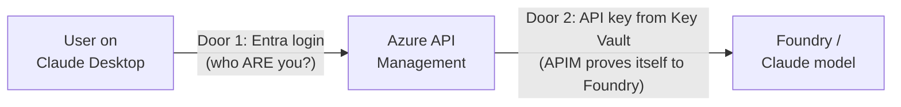

# Entra + APIM + Foundry Integration — Explained in Layman's Terms

Since the Foundry API key is now used to configure the Foundry model backend
in APIM, it's worth untangling the two separate "doors" in this design —
Entra and the Foundry API key protect completely different things.

## The two-door analogy

- **Door 1 — Entra (front door, user-facing):** proves the *human*'s
  identity to APIM.
- **Door 2 — API key (back door, machine-facing):** proves *APIM's*
  identity to Foundry.

The user never sees Door 2 at all.

## How Entra still fits in

1. User opens Claude Desktop → it redirects them to a Microsoft sign-in
   page (Entra).
2. User signs in with their normal work account → Entra hands back a
   signed token saying "this is jane@company.com, and she's in the
   approved pilot group."
3. Claude Desktop sends that token to APIM with every request.
4. APIM checks the token is valid, not expired, and issued by the right
   tenant/app — **before it even looks at the AI request**. If the token
   is bad, the request is rejected right there — Foundry is never even
   contacted.

Entra's job here is purely: *"Is this a legit, approved employee?"* It has
nothing to do with the Foundry key.

## How the Foundry connection works now

- The Foundry API key lives only in Key Vault — never in a config file,
  never sent by the user.
- APIM has its own "identity card" (a managed identity) that Entra (same
  tenant) trusts to read that one secret from Key Vault.
- On each approved request, APIM fetches the key and adds it as a header
  (`x-api-key`) when calling Foundry, on the user's behalf.
- Foundry doesn't know or care which human made the request — it only
  sees "a valid key from APIM." That's why this key alone can't do user
  tracking; it's shared by everyone.

## How user management works

- Who is *allowed to use the gateway at all* = membership in one Entra
  security group (`sg-claude-desktop-pilot`).
- Adding someone = add them to that group. Removing someone = remove
  them. No redeploy, no Bicep change — just an Entra group edit.
- Which *models* are allowed and any per-user limits = enforced
  separately, inside the APIM policy (the model-allowlist check and, if
  you add it, a per-user quota policy) — not by Entra or by Foundry.

## How you get usage metrics per user

This is the important part: **Foundry can't tell you who used what —
only APIM can**, because APIM is the only place that sees both the
user's identity (from the Entra token) *and* the request going to
Foundry, side by side.

- APIM logs every request to Application Insights / Log Analytics,
  including the caller's identity (pulled from the token's email/user-id
  field), timestamp, which model was requested, response time, and
  success/failure.
- You then run simple queries (KQL) or build a dashboard ("workbook") in
  Azure Monitor to answer questions like: *"How many calls did Jane make
  this week?"* or *"Which team used Claude the most?"*

## In one sentence

Entra answers "who's allowed in," the Key Vault-backed API key answers
"how does APIM talk to Foundry," and APIM's own logs (fed by the Entra
identity on each request) are what actually give you per-user tracking
and metrics — Foundry itself stays completely user-agnostic.
